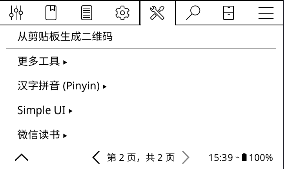
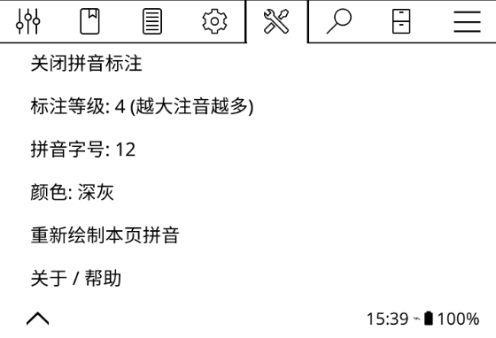
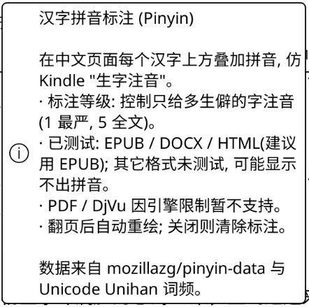
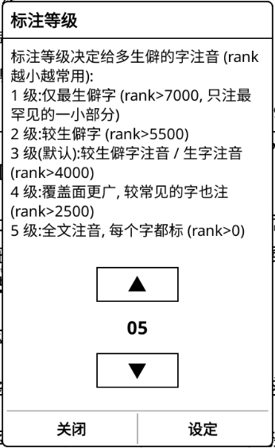
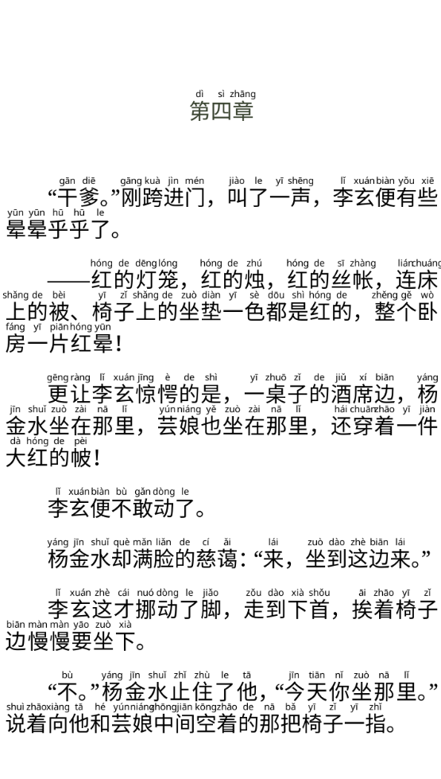
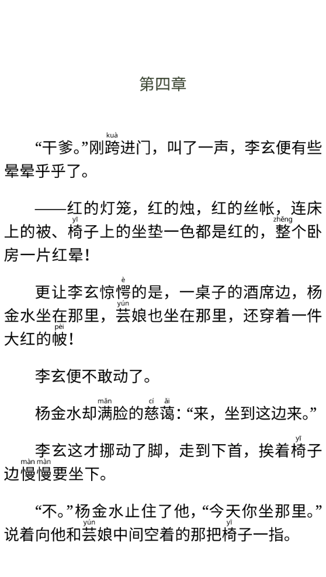

# 汉字拼音标注插件 (Pinyin for KOReader)

> ⚠️ **本插件完全免费、开源（GPL-3.0），官方渠道永远免费，直接来本仓库免费下载即可。**
> 近期有人在小红书等平台售卖本插件，请注意甄别，不要付费。

仿 Kindle「生字注音」功能:在中文页面每个汉字的**上方叠加拼音**,
并可按**常用度等级**控制只给较生僻的字注音。目前实测支持 EPUB / DOCX / HTML(建议使用 EPUB);其它格式未测试
可能显示不出拼音。

效果示意(每字上方叠加带声调拼音,按等级只标注较生僻字):

```
  zhōng  guó   rén   mín   xǐ  huān   dú   shū
   中    国    人    民    喜   欢    读   书
```

***

## 功能

* **逐字拼音**:用 crengine 取得当前页每个字的坐标,在屏幕上叠加拼音(带声调 ā á ǎ à)。

* **分级注音(核心)**:像 Kindle 生字注音一样,按汉字常用度分级(等级 1–5,可在「标注等级」菜单调节;越高注音越多;默认 2 = 生僻字):

  * **等级 1**:最生僻字注音(rank > 7000,最严)

  * **等级 2(默认)**:生僻字注音(rank > 6250)

  * **等级 3**:较生僻字注音(rank > 5500)

  * **等级 4**:生字较多,更常见的字也注(rank > 4750)

  * **等级 5**:生字注音,覆盖面最宽(rank > 4000)

  * 常用度排名(rank)来自《通用规范汉字表》**国家规定的字表顺序**(一级→二级→三级),rank 越小越常用,与频率梯度一致;扩展区/生僻字亦已放开收录。

* **可调样式**:拼音字号、颜色(黑/深灰);标注位置固定为汉字上方(不开放切换)。

* **自动重绘**:翻页后自动重新标注;关闭时清除标注。

* **数据全**:内置 8105 个汉字(通用规范汉字表全量,含扩展区字符)的「拼音 + 排名」,可自行追加自定义字。

* **生词本词组注音(v6.0 新增)**:查词时加入 KOReader 官方「生词本」(vocabbuilder)的词,在页面上**整词出现**才注音(词级精确匹配):「感悟」入本 → 只注整词出现的「感悟」,「感」「悟」单独出现不注;**单字**入本 → 该字每次出现都注。删改生词自动同步(翻页即生效,一次 stat 检查,微秒级)。生词读音优先取词组表(如「银行」→ yín háng),词不在表内则取词的最长前缀读音,再退逐字默认。
* **单字生词也走词组辨音(v6.1 修正)**:此前单字入本(如「行」)读音直接取默认,导致「行列」也被注成 xíng;v6.1 起单字生词的读音同样先查上下文词组(行列→háng、银行→háng、举行→xíng、单独出现→默认)。
* **词组辨音始终开启(v6.2)**:多音字辨音只对「本来就要注音」的多音字做纯查表(单字 <0.01ms、无注音页面成本为零、词组表惰性加载一次),不影响翻页速度,故不设开关。菜单仅保留「生词本注音: 开/关」一项,状态直接写在菜单文字里。
* **「关于/帮助」改版(v6.4)**:对外版本号显示为 **v2.0**(内部迭代号 6.4 仅记于此),描述按用户提供的简化文案重写(等级/生词本联动/多音字辨音/已测试格式/PDF 限制)。

* **多音字词组辨音(v6.0 新增)**:结合上下文 2~6 字词组判断多音字读音(最长匹配优先),如「银行」háng /「行走」xíng、「一丘之貉」hé /单字回退 háo;无匹配词组时回退该字常用读音。词组表(约 8600 词组/320KB)惰性加载,首次遇到多音字才读入。

* **默认读音修正(v6.0 新增)**:修正 kTGHZ2013 数据源把罕见读音排在前的 430 字(如 行 háng→xíng、重 chóng→zhòng、上 shǎng→shàng、期 jī→qī)。

* **单页注音上限 30(v6.0 新增,保险丝)**:极端密集页(生词极多/生僻字极密)在建计划阶段收满即停,扫描与绘制两头都省;诊断信息里以 capped 标记提示。

> **速度承诺(设计约束)**:以上新功能全部挂在「本来就要注音」的字之后做纯查表——无生词且无生僻字的页面快筛直接早退,成本严格为零;有目标页面的新增开销为微秒~毫秒级(页级生词快筛 <0.05ms、单字辨音查表 <0.01ms),0.25s 预算、行级收窄、24 页缓存机制原样保留。

***

## 安装

1. 把本目录整体复制到 KOReader 的插件目录:

   * 设备:`koreader/plugins/pinyin.koplugin/`

   * 或 KOReader 的 `plugins/` 目录(与官方插件同级)
2. 重启 KOReader。
3. 打开一本中文书 → 顶部菜单 → **「工具」→「汉字拼音 (Pinyin)」**。
4. 点「开启拼音标注」即可。

> 插件目录结构(直接拷到 KOReader 即可用):
>
> ```
> koreader/plugins/pinyin.koplugin/
> ├── main.lua                # 插件主体(无需改动)
> ├── pinyin_data.lua         # 拼音+排名数据(已生成, 开箱即用; 默认 8105 全量)
> ├── phrase_data.lua         # 词组辨音表(v6.0, 自动生成, 约 320KB, 惰性加载)
> ├── polyphone_index.lua     # 多音字索引(v6.0, 自动生成, 启动即载)
> ├── default_fix.lua         # 默认读音修正表(v6.0, 自动生成, 启动即载)
> ├── config.lua             # 高级配置(调试日志/诊断信息开关, 默认均关闭)
> └── README.md
> ```
>
> 三张 v6.0 数据表由 `gen_phrase_data.py`(上级目录)从 pypinyin 生成, 已随包提供, 无需再跑。

***

## 使用

在「汉字拼音」子菜单中:

| 菜单项                  | 作用                                                                                                |
| -------------------- | ------------------------------------------------------------------------------------------------- |
| 开启/关闭拼音标注            | 总开关                                                                                               |
| 标注等级                 | 1–5,越高注音越多(默认 2 = 生僻字);各级含义见下                                                                    |
| 生词本注音: 开/关         | v6.2:生词本里的词整词出现才注音(需装官方 vocabbuilder;默认开;开关状态显示在菜单文字里)                                        |
| (多音字词组辨音)          | v6.2:始终开启,不设开关(纯查表不影响翻页速度,如 银行 háng)                                                                   |
| 拼音字号                 | 8–28(**默认 12,首次使用请先调到 ≥ 26**),太小会显示不全/挤压;详见下「局限 / 已知问题」                                             |
| 颜色: 深灰               | 切换黑色 / 深灰(更贴近 Kindle 提示色)                                                                         |
| 调试日志 (写 KOReader 日志) | **默认隐藏**;在 `config.lua` 把 `enable_debug_log` 设为 `true` 并重启后才出现;开启后把每页取字/拼音数据/等级过滤结果写入 `crash.log` |
| 查看诊断信息               | **默认隐藏**;在 `config.lua` 把 `show_diagnostics` 设为 `true` 并重启后才出现;开启后可直接查看本页注音统计                     |
| 关于 / 帮助              | 说明                                                                                                |

### 标注等级说明 (1–5)

「标注等级」决定给多生僻的字注音:rank 越小越常用,rank 越大越生僻;只有 rank 大于该等级阈值(见下)的字才被画上拼音。可在「汉字拼音」子菜单里用 ↑/↓ 调节。

| 等级        | 含义            | rank 阈值     |
| --------- | ------------- | ----------- |
| **1**     | 最生僻字注音        | rank > 7000 |
| **2(默认)** | 生僻字注音         | rank > 6250 |
| **3**     | 较生僻字注音        | rank > 5500 |
| **4**     | 生字较多,更常见的字也注 | rank > 4750 |
| **5**     | 生字注音(覆盖面最宽)  | rank > 4000 |

> 阈值与代码 `LEVEL_THRESHOLD = {7000,6250,5500,4750,4000}` 完全一致,默认等级 2。
> 想"只给最难的字注音"就往低调(1);想"标注更多字"就往高调(5)。

### 调试日志(排查为何有些字没注音)

打开「调试日志」开关后,每次翻页/重绘都会在 KOReader 的日志(`crash.log`,位于 KOReader 数据目录)里写入一行统计,例如:

```
[Pinyin] page=3 level=5 thr=4000 method=tr | boxes=142 words=138 chars=410 with_data=408 shown=52 filtered=356 no_data=2 iter=138 elapsed=120ms
```

字段含义:

* `level` / `thr` — 当前标注等级与对应阈值

* `method` / `iter` / `elapsed` — 取字方法、迭代次数、本页绘制耗时(毫秒)

* `boxes` — 当前页取到的文本盒子总数

* `words` — 成功取到汉字的盒子数

* `chars` — 拆出的总字数

* `with_data` — 在 `pinyin_data.lua` 里有拼音数据的字数

* `shown` — 实际被画上拼音的字数

* `filtered` — 有数据但被等级阈值拦掉的字数(**常用字被拦属正常现象**,任何等级下都可能 >0)

* `no_data` — 不在拼音数据里的字数(生僻字/异体字,可忽略或补充)

开启后翻几页,把 `crash.log` 里这些行发回即可定位问题(是数据缺失还是等级逻辑异常)。

***

## 高级配置 (config.lua)

插件根目录下的 `config.lua` 提供两个**高级开关,默认均为关闭 (false)**。修改后需**重启 KOReader** 才生效:

| 配置项                | 默认      | 作用                                                                        |
| ------------------ | ------- | ------------------------------------------------------------------------- |
| `enable_debug_log` | `false` | 是否在「汉字拼音」菜单中显示「调试日志 (写 KOReader 日志)」项。开启后,翻页/重绘会把取字与等级过滤细节写入 `crash.log`。 |
| `show_diagnostics` | `false` | 是否在「汉字拼音」菜单中显示「查看诊断信息」项。开启后,可在阅读菜单里直接查看本页注音统计与判读,无需去翻 `crash.log`。        |

> 这两项默认关闭,普通用户无需改动;只有排查问题或想看诊断统计时才把对应项设为 `true`。
> 修改 `config.lua` 请用纯文本编辑器(不要带 BOM),保存后重启 KOReader。

***

## 局限 / 已知问题

* **PDF / DjVu 不支持**：它们使用不同的渲染引擎，本插件会自动跳过（不报错）。

* **格式兼容性（已测试 / 未测试）**：已实测 EPUB / DOCX / HTML 可正常取字并标注拼音；其它格式（如 FB2 / TXT / DOC 等）未充分测试，可能取不到字、显示不出拼音。**建议优先使用 EPUB 书籍**。

* **性能**:每翻页会对当前页每个字调用一次坐标查询并绘制拼音,页面字数很多时(如密集排版)
  可能有数十毫秒延迟。若觉得卡,可**降低「标注等级」(只标更少字,如调到 1–2)** 或调小拼音字号
  (等级越高、注音越多,绘制开销越大;详见上文「标注等级说明」)。

* **多音字**:目前取词频最高的首选读音,未做上下文消歧(与 Kindle 行为类似)。

* **顶部/底部重叠**:插件固定把拼音画在汉字**上方**;若被状态栏或页脚遮挡,可调小拼音字号或增大页边距(不再提供上/下切换)。

* **拼音字号过小会影响展示**:拼音是按固定像素字号叠加在汉字上方的。插件**默认字号为 12**,首次开启后请先把「拼音字号」调到 **26 以上**再看效果;若「拼音字号」设得太小(如 8–20),拼音很可能**显示不全、被压扁或与汉字重叠**,看起来像"没注音"。**建议把字号调整到 26 以上**;若仍偏小,可继续调大或增大页边距来获得足够空间。

***

## 使用截图

插件入口：



菜单：



关于：



设置：



效果：

5级：



四级：



<br />

## 后续可改进

* 用 `<ruby>` 标签在 EPUB 原文层注入拼音(随引擎重排、最干净,但需预处理书籍)。

* 多音字按上下文选择读音。

* 把数据按需懒加载,降低内存占用。

***

## 许可

插件代码与生成脚本以 GPL-3.0 发布(与 KOReader 一致)。
拼音数据 © 其原始作者(mozillazg/pinyin-data,MIT;Unicode Unihan,见 Unicode 许可)。
